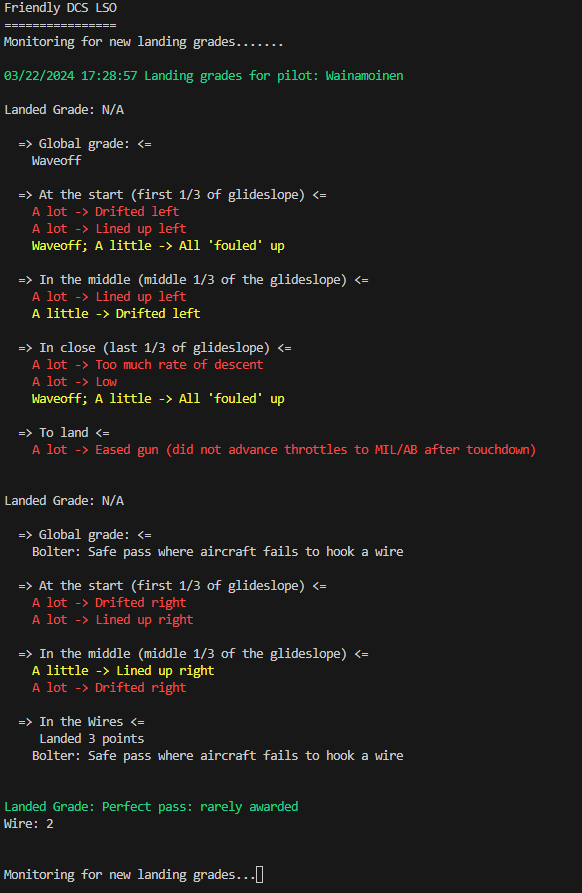

# Friendly DCS LSO

Friendly DCS LSO is a simple PowerShell Core script that helps you convert LSO landing grades into a more friendly, easier-to-understand mode.

## Why Use It

LSO landing grades contain valuable information to improve your carrier landings. This is especially true at the beginning of your DCS pilot career. However, after a hasty carrier landing, you might not be at your best trying to understand LSO grades. This script provides an easy way to understand LSO grades.

## How to Use It

1. Either clone the repository to your local machine or download the files. You need to have `Monitor-LandingGrades.ps1` and `LSOPhraseParser.ps1` files available.
2. Run `Monitor-LandingGrades.ps1` from `pwsh.exe`.
    ```powershell
    .\Monitor-LandingGrades.ps1
    ```
3. Start DCS and fly your mission. 
4. Once done flying, save the debriefing log to the `%UserProfile%\Saved Games\DCS\Missions` folder. 
Remeber to save to folder that is monitored by `Monitor-LandingGrades.ps1` script

> **Note!** If you prefer, you can set the script to monitor a different folder than `%UserProfile%\Saved Games\DCS\Missions`. In this case, also store your debriefing logs in to that folder.
5. The script automatically monitors your DCS `%UserProfile%\Saved Games\DCS\Missions` folder and parses all LSO landing grades from new log files.
6. Read Friendly LSO Gradings from the `pwsh.exe` window. 


## Alternative Ways of Using

### Using the ParseLogFile Parameter

If you want to parse a specific log file immediately, you can use the `ParseLogFile` parameter. Provide the full path to the log file as the argument. The script will parse this file, display the landing grades, and then exit. Here's an example:

```powershell
.\Monitor-LandingGrades.ps1 -ParseLogFile "C:\path\to\your\log\file.log"
```

### Using the ParseOldFiles Parameter
If you want to parse some old files When starting to monitor for new files you can use the ParseOldFiles parameter. Provide the age of the files (use PowerShell [timespan]) as the argument. The script will parse files that are newer than the given value at the start and then starts to monitor new files. 

Here's an example:

```powershell
.\Monitor-LandingGrades.ps1 -IncludeFilesNewerThan ([timespan]::FromMinutes(35))
```

In this example, the script will also parse files that are newer than 35 minutes at the start and then continue monitoring for new files.

Happy flying!